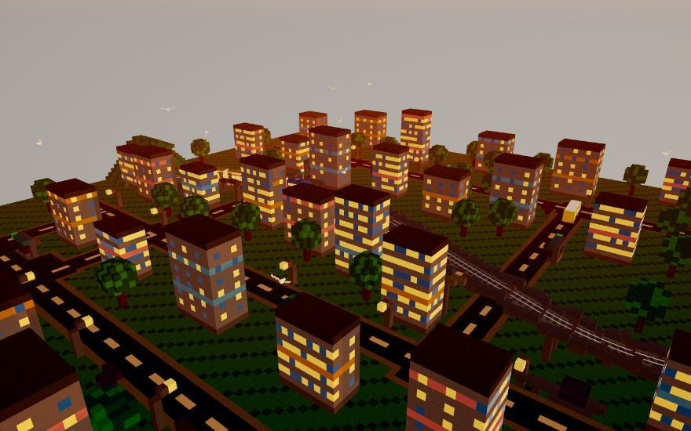
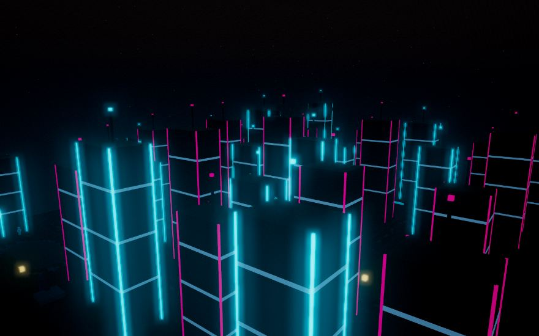

# 🚂 Trans City Express — Voxel Diorama

**🌐 Zobacz dioramę live: [stojeden.github.io/voxel-diorama](https://stojeden.github.io/voxel-diorama/)**

> Żywa, voxelowa diorama miasta w przeglądarce: pociąg przejeżdżający przez kwantowe portale, pełny cykl dnia z prawdziwym golden hour, losowa pogoda z zalegającym śniegiem, rytm nocnego miasta i krowa porywana przez UFO. Three.js + TypeScript, z celem 60 FPS na Apple M1 Pro.
>
> *A living voxel city diorama in the browser — day/night cycle, weather, themed morphing (including a full Cyberpunk transformation) and a cast of tiny story actors.*

| Zmierzch nad miastem | Morfing Cyberpunk |
|---|---|
|  |  |

## ✨ Co tu żyje

### Świat i pojazdy
- **Pociąg** na gładkiej trasie (krzywizna pilnowana testami — zero „łamania" wagonów), z wózkami wagonowymi, reflektorami oświetlającymi tory nocą i przystankami, na których pasażerowie wsiadają do wagonów.
- **Tunele-portale** — skład wjeżdża do wschodniego tunelu i *w tym samym momencie* jego czoło wyjeżdża z zachodniego (każdy wagon zawija trasę niezależnie). Portale zdobią pulsujące, kwantowe pierścienie.
- **Wiadukt** z podniesioną estakadą i peronem na wysokości — autobus przejeżdża pod spodem.
- **Autobus miejski** na pętli przez całe miasto: 5 przystanków (w tym nad jeziorem), kolejki pasażerów przy wiatach, a na przejeździe kolejowym ustępuje pociągowi. O 23:30 wykonuje ostatnią pętlę i zabiera oczekujących, znika na noc, a od 04:50 rozwozi ludzi z powrotem na przystanki.
- **Prawdziwe tory**: ciągłe stalowe szyny, drewniane podkłady, tłuczniowa podsypka.
- **Żywe przystanki i stacje**: pasażerowie korzystają z tras omijających ławki, słupy, wiaty, barierki i bryły dworców zamiast przenikać przez geometrię.

### Światło i atmosfera
- Fizyczne niebo (rozpraszanie Rayleigha/Mie) — **efektowne wschody słońca i golden hour**, płynne przejścia wszystkich faz dnia oraz odbicia nieba i słońca w szybach budynków (PMREM environment z GPU crossfade).
- **Fazy księżyca**, gwiazdy, spadające gwiazdy, **zorza polarna** w pogodne noce.
- **Zaćmienia słońca** — w losowe dni księżyc nasuwa się na słońce: świat ciemnieje, zapalają się latarnie, mewy w popłochu siadają.
- **Automat pogodowy**: chmury voxelowe, deszcz (mokry, lustrzany asfalt), śnieg z **zalegającą zimą** (białe dachy, oszronione drzewa, **zamarzające jezioro**), mgła i wiatr kołyszący drzewami.
- **Zegar 1× / 2× / 3×** oraz tryb **⏱ REAL TIME** — pora dnia i pogoda synchronizują się z lokalizacją widza (geolokalizacja + SunCalc + Open-Meteo).
- **Rytm mieszkań**: około północy gasną pierwsze okna, o 01:42 kolejne, o 02:30 pozostają pojedyncze światła, o 02:45 bloki są ciemne, a od 04:00 miasto budzi się sekwencyjnie.
- **Oświetlenie bezpieczeństwa**: wiaty mają zewnętrzne, dwustronne lightboxy i oprawy pod dachem, a dworce nocą pozostają jaśniejsze od przystanków.

### Motywy (🎭) z morfingiem
| Motyw | Klimat |
|---|---|
| Klasyczny | bazowa diorama |
| Retro PRL | sepia, wyblakłe tynki, pociąg w liverze retro |
| Złota jesień | rude korony drzew, niskie słońce |
| Zabawkowy | cukierkowa paleta makiety |
| **Cyberpunk** | pełny morfing: z ziemi **wyrastają neonowe megabloki**, pociąg staje się nocnym ekspressem, autobus dostaje cyberlakier, balon zamienia się w kosmiczny odrzutowiec, wędkarz w hologram, a mewy/krowa/UFO znikają. Powrót = morfing wsteczny. |

### Smaczki fabularne
- 🐄 **Krowa i UFO** — krowa pasie się nad jeziorem; co drugą noc latający spodek wciąga ją wiązką, a następnej nocy odstawia. Rankiem po porwaniu **rolnik** szuka jej, drapie się po głowie i wygraża kosmitom — a po powrocie radośnie ją klepie.
- 👽 Czasem kosmici robią zamiast tego **nalot na kiosk** (rano stoi zapora „zamknięte").
- 🎣 **Wędkarz** w czapeczce, ze skrzynką: rano wychodzi z bloku, łowi nad brzegiem (raz na kilka brań wyciąga rybę wielką jak on sam — zawsze ucieka), zimą **łowi w przeręblu na środku zamarzniętego jeziora**, siedząc na dopasowanym stołku z poprawnie zgiętymi nogami, a wieczorem wraca do domu.
- 📮 **Listonosz** na rowerze objeżdża rano południową dzielnicę — czasem goni go pies.
- 🎈 **Balon** na ogrzane powietrze przelatuje w pogodne dni i o zmierzchu, pięknie podświetlony ogniem palnika.
- 🕊️ **Mewy** szybują, bankują w zakrętach i nocą śpią na dachach.

## 🎮 Sterowanie

| Akcja | Klawisz / UI |
|---|---|
| Obrót / przesuwanie / zoom kamery | mysz (drag / PPM / scroll) |
| Kamera TPP za pociągiem | `T` lub 🚆 |
| Kamera TPP za autobusem | `B` lub 🚌 |
| Filmowy oblot dioramy (wschód→zachód) | „Pokaż dioramę" |
| Prędkość zegara | `1` `2` `3` |
| Tryb czasu rzeczywistego | `R` lub ⏱ REAL TIME |
| Pogoda (auto → słońce → chmury → deszcz → śnieg → mgła) | `W` lub przycisk pogody |
| Motyw dioramy | 🎭 |
| Prędkość pociągu | suwak / `←` `→` |
| Pauza | spacja |
| Jakość renderingu (Auto → Low → Medium → High) | `Q` lub przycisk jakości |

## 🚀 Szybki start

```bash
npm install
npm run dev      # http://localhost:5173
```

```bash
npm test         # 78 testów (vitest): geometria, światło, rytm miasta,
                 # nawigacja pieszych, aktorzy i maszyny stanów pojazdów
npm run typecheck # typy
npm run build    # produkcja → dist/
npm run validate # typy + unit + build + Chrome/WebGL + budżety wydajności
BENCH_HEADFUL=1 npm run test:performance # jeden Chrome, 3 scenariusze Metal/High
```

Wymagania: Node 20.19+, przeglądarka z WebGL2. Cel wydajnościowy to **stabilne 60 FPS na Apple M1 Pro** w profilu High. Twardy benchmark zachowuje próg 58 FPS; po rozszerzeniu sceny szeroki overview wymaga dalszego profilowania i ponownego pomiaru na chłodnym urządzeniu.

### Profile jakości

- **Auto** dobiera profil startowy do liczby rdzeni i pamięci, a następnie reaguje na utrzymujący się czas klatki z cooldownem i histerezą.
- **Low / Medium / High** kontrolują DPR, cienie, bloom, AO, cząstki pogody, liczbę aktorów, etykiety, częstotliwość PMREM i budżety świateł ulicznych, przystankowych, dworcowych oraz okiennych.
- W trybie deweloperskim klawisz `P` włącza ładowany na żądanie panel `stats-gl` z FPS oraz czasem CPU/GPU.
- `window.__diorama.getMetrics()` udostępnia draw calle, trójkąty, pamięć renderera i aktywny profil dla diagnostyki oraz testów.

### Stan walidacji

- 78/78 testów jednostkowych w 12 plikach testowych.
- `npm run typecheck` i produkcyjny `npm run build` przechodzą.
- Smoke test obejmuje desktop/mobile, niepusty canvas, luminancję, ochronę przed przepaleniami, kolizje pieszych, rytm miasta i budżety renderera.
- Dedykowany benchmark Metal zachowuje próg 58 FPS. Kamera pociągu przekraczała 60 FPS, ale szeroki pierwszy overview był niestabilny podczas serii pomiarów; wynik nie jest przedstawiany jako zaliczony.
- Preloader kompiluje dzienne i nocne warianty shaderów, wykonuje ukryte klatki composera i opróżnia kolejkę GPU przed odsłonięciem sceny.

## 🏗️ Architektura

```
src/
├── main.ts                  # pętla animacji i orkiestracja wszystkiego
├── bootstrap.ts             # renderer, composer HDR, kamera i postprocessing
├── ui.ts                    # panel sterowania
├── CinematicTour.ts         # filmowy oblot
├── performance/
│   ├── QualityManager.ts    # profile jakości i adaptacja Auto
│   └── DevStats.ts          # ładowany na żądanie profiler CPU/GPU
├── experience/
│   ├── Themes.ts            # motywy (palety + światło + morfing cyber)
│   └── RouteChapters.ts     # narracyjne etykiety trasy
├── environment/
│   ├── sky.ts               # czysty model słońca/kolorów (testowalny)
│   ├── CityRhythm.ts        # rozkład autobusu i sekwencje świateł mieszkań
│   ├── DayNightCycle.ts     # niebo, księżyc, światła, zaćmienia, PMREM crossfade
│   ├── LakeSurface.ts       # PBR jeziora, fale, deszcz, zamarzanie i mgła
│   ├── Weather.ts           # automat pogodowy, chmury, śnieg, wiatr, mokro
│   └── RealTime.ts          # geolokalizacja + SunCalc + Open-Meteo
├── effects/
│   ├── PortalGlow.ts        # kwantowe pierścienie tuneli
│   ├── Balloon.ts           # balon / kosmiczny odrzutowiec
│   └── GlitchTimeDilation.ts# grading filmowy (golden hour, sepia, vibrance)
└── world/
    ├── WorldLayout.ts       # ŹRÓDŁO PRAWDY: trasy, drogi, kotwice aktorów
    ├── WorldGenerator.ts    # voxelowe miasto, tory, zima, cyber-wieże
    ├── Train.ts / Bus.ts    # pojazdy z maszynami stanów
    ├── BusStopNavigation.ts # kolidery i trasy pieszych przy wiatach
    ├── StationNavigation.ts # kolidery i trasy pieszych na dworcach
    ├── Birds.ts             # mewy (szybowanie/bankowanie/sen)
    ├── LakesideCow.ts       # krowa + UFO + rolnik + nalot na kiosk
    ├── Fisherman.ts         # wędkarz (brzeg/przerębel/hologram)
    ├── Postman.ts           # listonosz + pies
    ├── PassengerCrowd.ts    # pasażerowie na peronach
    └── LakeLife.ts          # skaczące ryby
```

Zasada projektu: **cała geometria świata mieszka w `WorldLayout.ts`**, a testy w `WorldLayout.test.ts` pilnują, by nic na nic nie nachodziło (trasy na asfalcie, aktorzy poza wodą/torami/budynkami, skrajnia tunelu większa od obwiedni pociągu, krzywizna trasy poniżej progu „łamania").

## 🛠️ Stack

[Three.js](https://threejs.org/) · TypeScript · Vite · Vitest · Playwright · [pmndrs/postprocessing](https://github.com/pmndrs/postprocessing) · [camera-controls](https://github.com/yomotsu/camera-controls) · [stats-gl](https://github.com/RenaudRohlinger/stats-gl) · [SunCalc](https://github.com/mourner/suncalc) · [Open-Meteo](https://open-meteo.com/) (pogoda na żywo, bez klucza API)

## 📄 Licencja

MIT — patrz [LICENSE](LICENSE).

Historia zmian: [CHANGELOG.md](CHANGELOG.md).
