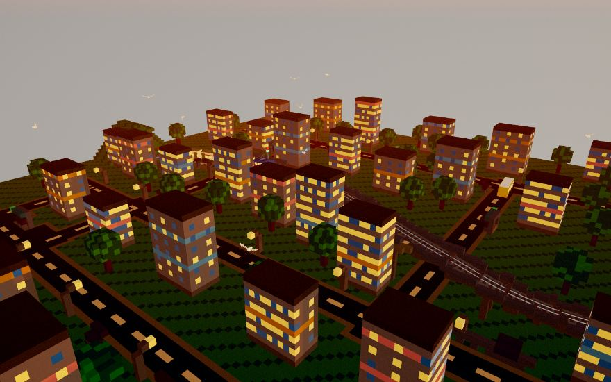
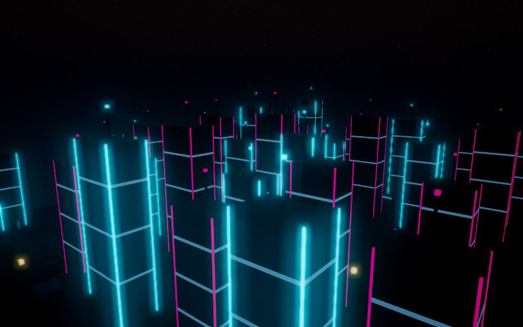

# 🏙️ Miasto — Voxel Diorama

**🌐 Zobacz dioramę live: [stojeden.github.io/voxel-diorama](https://stojeden.github.io/voxel-diorama/)**

> Żywa, voxelowa diorama miasta w przeglądarce: pociąg przejeżdżający przez kwantowe portale, pełny cykl dnia z prawdziwym golden hour, losowa pogoda z zalegającym śniegiem, rytm nocnego miasta i krowa porywana przez UFO. Three.js + TypeScript, z celem 60 FPS na Apple M1 Pro.
>
> *A living voxel city diorama in the browser — day/night cycle, weather, themed morphing (including a full Cyberpunk transformation) and a cast of tiny story actors.*

| Zmierzch nad miastem | Morfing Cyberpunk |
|---|---|
|  |  |

## ✨ Co tu żyje

### Świat i pojazdy
- **Pociąg** na gładkiej trasie (krzywizna pilnowana testami — zero „łamania" wagonów), z wózkami wagonowymi, reflektorami oświetlającymi tory nocą i przystankami, na których pasażerowie wsiadają do wagonów.
- **Tunele-portale** — skład wjeżdża do wschodniego tunelu i *w tym samym momencie* jego czoło wyjeżdża z zachodniego (każdy wagon zawija trasę niezależnie). Portale zdobią pulsujące, kwantowe pierścienie.
- **Wiadukt** z podniesioną estakadą i peronem na wysokości — autobus przejeżdża pod spodem.
- **Autobus miejski** na pętli przez całe miasto: 5 przystanków (w tym nad jeziorem), kolejki pasażerów przy wiatach, a na przejeździe kolejowym ustępuje pociągowi. O 23:30 wykonuje ostatnią pętlę i zabiera oczekujących, znika na noc, a od 04:50 rozwozi ludzi z powrotem na przystanki.
- **Prawdziwe tory**: ciągłe stalowe szyny, drewniane podkłady, tłuczniowa podsypka.
- **Żywe przystanki i stacje**: pasażerowie korzystają z tras omijających ławki, słupy, wiaty, barierki i bryły dworców zamiast przenikać przez geometrię.

### Światło i atmosfera
- Fizyczne niebo (rozpraszanie Rayleigha/Mie) — **efektowne wschody słońca i golden hour**, płynne przejścia wszystkich faz dnia oraz odbicia nieba i słońca w szybach budynków. Neutralna mapa PMREM powstaje w preloaderze, a światło i atmosfera zmieniają się bez kosztownych regeneracji w pętli animacji.
- **Fazy księżyca**, gwiazdy, spadające gwiazdy, **zorza polarna** w pogodne noce.
- **Eclipse 2.0** — 96-sekundowe, deterministyczne zaćmienie uruchamiane klawiszem `E` albo losowane przez świat od drugiego dnia symulacji. Naturalne zaćmienie nigdy nie rusza kamerą i nie może wystąpić dzień po dniu; ręczne uruchomienie zastępuje automatyczne zdarzenie danego dnia. Podczas zjawiska Księżyc przechodzi przez kolejne kontakty, pojawia się pierścień diamentowy, korona, chromosfera, protuberancje, perły Baily'ego i gwiazdy. Pod drzewami widać projekcje sierpów, a w High tuż przy kontakcie pojawiają się shadow bands. Mieszkańcy zwalniają, patrzą ku Słońcu, używają przyczepionych do głów okularów lub kart projekcyjnych; pies reaguje na zmianę światła, a jezioro odbija koronę.
- **Automat pogodowy**: chmury voxelowe, deszcz (mokry, lustrzany asfalt), śnieg z **zalegającą zimą** (białe dachy, oszronione drzewa, **zamarzające jezioro**), mgła i wiatr kołyszący drzewami.
- **Tęcza po deszczu oparta na optyce geometrycznej**: zależna od obserwatora oś antysłoneczna, dyspersja 400–700 nm wyprowadzona z prawa Snella, D65/CIE/Fresnel, lokalna kurtyna wilgoci po opadzie oraz przycinanie do aktualnej głębokości sceny. Histogram rodzin promieni pierwszego i drugiego rzędu przez kuliste krople tworzy kaustyki, ogony rozpraszania i przerwę pasma Aleksandra; High dodaje słabą tęczę wtórną. Osobny deterministyczny RNG wybiera po każdym opadzie kurtynę nad jeziorem, łąką albo północnym parkiem, dlatego pozorny początek i koniec wynikają z kamery, Słońca, kropel i geometrii świata zamiast stałych punktów. Efekt narasta w kilka sekund i przy dobrych warunkach pozostaje wyraźny zwykle przez około 60–75 sekund czasu rzeczywistego. Używa wyłącznie małego LUT generowanego przy starcie — bez importowanej tekstury ani dodatkowych świateł.
- **Zegar 1× / 2× / 3×** oraz tryb **⏱ REAL TIME** — obecna wersja synchronizuje porę dnia, fazę Księżyca i pogodę przez SunCalc + Open-Meteo; przy aktywacji prosi o lokalizację, a po odmowie używa Warszawy. W roadmapie jest zastąpienie tego trybem bez promptu, opartym o strefę czasową przeglądarki i jawnie opisaną lokalizację przybliżoną.
- **Rytm mieszkań**: około północy gasną pierwsze okna, o 01:42 kolejne, o 02:30 pozostają pojedyncze światła, o 02:45 bloki są ciemne, a od 04:00 miasto budzi się sekwencyjnie.
- **Oświetlenie bezpieczeństwa**: wiaty mają zewnętrzne, dwustronne lightboxy i oprawy pod dachem, a dworce nocą pozostają jaśniejsze od przystanków.

### Motywy (🎭) z morfingiem
| Motyw | Klimat |
|---|---|
| Klasyczny | bazowa diorama |
| Retro PRL | sepia, wyblakłe tynki, pociąg w liverze retro |
| Złota jesień | rude korony drzew, niskie słońce |
| Zabawkowy | cukierkowa paleta makiety |
| **Cyberpunk** | pełna **podmiana reprezentacji miasta**: 34 działki mieszkalne i oba dominanty ustępują miejsca własnej reprezentacji, a nie drugiej warstwie nad pierwszą. Megabloki mają stopniowane bryły, ograniczone nadwieszenia, piony instalacyjne, żebra, techniczne korony i trzy rodzaje stref okien. Ciepłownia zostaje zakładem energetycznym z halami, chłodniami i rurociągiem, komin kominem, a wieża RTV smukłą wieżą transmisyjną z platformami i pierścieniami. Pociąg dostaje aerodynamiczne czoło i ciągły pas szyb, autobus — LED-y pod progami, które **znaczą asfalt** pod sobą, a na mokrej jezdni dają dodatkowo węższe odbicie zaraz obok nadwozia (jedna addytywna płaszczyzna, zero nowych świateł dynamicznych; siła rośnie z nocą i wilgotnością drogi). Ulice, chodniki, latarnie, drzewa i spożywczak zostają bez zmian: to układ miasta, wspólny dla obu stylów. Powrót = morfing wsteczny, pełne zwykłe miasto. |

### Smaczki fabularne
- 🐄 **Krowa i UFO** — krowa pasie się nad jeziorem; co drugą noc latający spodek wciąga ją wiązką, a następnej nocy odstawia. Rankiem po porwaniu **rolnik** szuka jej, drapie się po głowie i wygraża kosmitom — a po powrocie radośnie ją klepie.
- 👽 Czasem kosmici robią zamiast tego **nalot na spożywczak** — rano sklep po prostu nie zapala świateł w swoich godzinach otwarcia, zamiast stawiać zaporę przed drzwiami.
- 🎣 **Wędkarz** w czapeczce, ze skrzynką: rano wychodzi z bloku, łowi nad brzegiem (raz na kilka brań wyciąga rybę wielką jak on sam — zawsze ucieka), zimą **łowi w przeręblu na środku zamarzniętego jeziora**, siedząc na dopasowanym stołku z poprawnie zgiętymi nogami, a wieczorem wraca do domu.
- 📮 **Listonosz** w niebieskim uniformie, czapce i z przewieszoną torbą objeżdża
  rano południową dzielnicę. Ma trzy osobne punkty doręczeń, a czasem goni go
  pies; stabilny yaw roweru utrzymuje postać nad jezdnią także podczas pościgu
  i na ciasnych zakrętach.
- 🏭 **Dym z komina ciepłowni** w obu stylach: cienka smuga powstaje przy samym wylocie, unosi się, po czym łagodnie odchyla z **wiatrem świata** (tym samym, który kołysze drzewami), rozprasza się i zanika. Cały cykl życia liczy shader z jednej liczby na cząstkę, więc nie ma alokacji w pętli klatki; Low rysuje 9 cząstek zamiast 26. Efekt jest deterministyczny — wynika z zegara symulacji i seeda, nie z losowania — więc checkpoint zamraża także smugę.
- 🎈 **Balon** na ogrzane powietrze przelatuje w pogodne dni i o zmierzchu, pięknie podświetlony ogniem palnika.
- 🕊️ **Mewy** szybują i bankują w zakrętach. Przy narastającym zaćmieniu od 85% pokrycia wybierają najbliższe dachy i kolejno na nich siadają; po totalności wzlatują, gdy pokrycie spadnie do 65%. Nocą również śpią na dachach.

## 👀 Co dzieje się teraz

Diorama startuje bezpośrednio od miasta. Po preloaderze kamera jest od razu wolna,
a scena interaktywna — nie ma panelu startowego, revealu, touru ani ruchu kamery,
o który użytkownik nie poprosił. To świadoma decyzja produktowa, nie luka UX.

Zamiast onboardingu w prawym dolnym rogu HUD-u działa dyskretny status, który
pokazuje **najwyżej jedno rzeczywiście trwające wydarzenie** — w kolejności:
aktywne zaćmienie, rozdział touru (tylko jeśli użytkownik sam go uruchomił),
widoczna tęcza, postój pociągu, postój autobusu. Kiedy nic się nie dzieje, status
nie wyświetla niczego: żadnych podpowiedzi, zachęt ani tekstów zastępczych.
Stan świata pozostaje jedynym źródłem prawdy — status nic nie przewiduje i nie
zgaduje z upływu czasu.

Przy trwającym wydarzeniu obok statusu pojawia się przycisk „Pokaż". Dopiero
świadome kliknięcie (mysz, dotyk, `Enter` lub spacja na sfokusowanym przycisku)
prosi `CameraDirector` o miękki kadr. Samo pojawienie się komunikatu nigdy nie
rusza kamerą, a pierwszy `pointerdown`, drag, dotyk, scroll albo klawisz
sterowania natychmiast oddaje kamerę użytkownikowi i zachowuje ten pierwszy gest.
Wydarzenie w świecie pozostaje przy tym nietknięte.

## 🎮 Sterowanie

| Akcja | Klawisz / UI |
|---|---|
| Obrót / przesuwanie / zoom kamery | mysz (drag / PPM / scroll) |
| Kamera TPP za pociągiem | `T` lub 🚆 |
| Kamera TPP za autobusem | `B` lub 🚌 |
| Filmowy tour: pociąg → autobus → jezioro → mieszkańcy → golden hour → totalność → Cyberpunk | „Pokaż dioramę" |
| Kadr na trwające wydarzenie („Co dzieje się teraz") | „Pokaż" w statusie — tylko gdy wydarzenie faktycznie trwa |
| Prędkość zegara | `1` `2` `3` |
| Tryb czasu rzeczywistego | `R` lub ⏱ REAL TIME |
| Zaćmienie Słońca / szeroki widok zjawiska | `E` lub „Zaćmienie” |
| Pogoda (auto → słońce → chmury → deszcz → śnieg → mgła) | `W` lub przycisk pogody |
| Motyw dioramy | 🎭 |
| Pauza | spacja |
| Jakość renderingu (Auto → Low → Medium → High) | `Q` lub przycisk jakości |

## 🚀 Szybki start

```bash
npm install
npm run dev      # http://localhost:5173 — bez automatycznego otwierania kolejnej karty
```

```bash
npm test         # 172 testy (vitest): geometria, światło, optyka, rytm miasta,
                 # deterministyczność, kamera, tour, status wydarzeń, aktorzy i pojazdy
npm run typecheck # typy
npm run build    # produkcja → dist/
npm run validate # typy + unit + build + Chrome/WebGL + budżety wydajności
npm run test:acceptance # PEŁNY odbiór: typy, unit, składnia harnessów, podpisany build,
                 # browserSmoke oraz spikeSmoke w każdej fazie osobno i w świecie voxel
BENCH_HEADFUL=1 npm run test:performance # 7 stanów, 15 pomiarów (para tęczy 5× AB/BA), Metal/High
```

**`npm run test:acceptance` jest jedyną komendą, która wykonuje cały odbiór.** Samo
`node scripts/spikeSmoke.mjs` uruchamia wyłącznie domyślną fazę `frames` na świecie
hybrydowym — fazy `gate3`, `materials`, `postman` i `train` wymagają `SPIKE_PHASE`, a świat
wokselowy (i jego budżet 500 geometrii) wymaga `SPIKE_WORLDS=voxel`. Przebieg fazy `frames`
nie jest przebiegiem spikeSmoke'a. Odbiór wykonuje każdy krok do końca, także po
niepowodzeniu wcześniejszego, wypisuje kod wyjścia każdego z nich i sam kończy się
niezerowo, jeśli którykolwiek nie przeszedł. Wymaga czystego drzewa: build jest podpisywany
raz, a każdy harness weryfikuje ten sam pakiet.

Fazy `frames`, `gate3`, `postman`, `train` i `materials` uruchamiane są jako osobne kroki, a
nie jednym `SPIKE_PHASE=all`. `all` wykonuje ten sam zestaw, ale w jednym procesie — pierwsza
asercja, która padnie, zabiera ze sobą fazy jeszcze nieuruchomione i ich stan pozostaje
nieznany. Osobne kroki kosztują jedną sesję przeglądarki każdy i dają wynik dla każdej fazy
za każdym razem.

Każdy krok deklaruje własny świat, fazę i profile. Odbiór usuwa z środowiska procesów
potomnych `SPIKE_PHASE`, `SPIKE_WORLDS`, `SPIKE_QUALITIES`, `SPIKE_SUMMARY`, `SPIKE_OUT_DIR`,
`SPIKE_FRAME_DIR` i `SMOKE_DIAGNOSTIC`, żeby wartość zostawiona w powłoce nie zwęziła po
cichu pełnego przebiegu; zignorowane wartości wypisuje na wejściu. Podsumowanie ma trzy
stany: `PASS`, `FAIL` oraz `ODSTEPSTWO` — jawnie zaakceptowane ograniczenie tej wersji, które
**nie** jest liczone jako wynik zaliczony.

Wymagania: Node 20.19+, przeglądarka z WebGL2. Cel wydajnościowy to **stabilne 60 FPS na Apple M1 Pro** w profilu High. Twardy benchmark zachowuje próg 58 FPS oraz limit p95 20,5 ms.
Benchmark ma blokadę procesu i sam odrzuca równoległe uruchomienie, dzięki czemu
wyniku nie zaniżają dodatkowe instancje Dioramy. Kolejne serie należy uruchamiać
sekwencyjnie, przy zamkniętych ręcznych kartach aplikacji.

### Profile jakości

- **Auto** dobiera profil startowy do liczby rdzeni i pamięci, a następnie reaguje na utrzymujący się czas klatki z cooldownem i histerezą.
- **Low / Medium / High** kontrolują DPR, cienie, bloom, AO, cząstki pogody, liczbę aktorów, etykiety i budżety świateł ulicznych, przystankowych, dworcowych oraz okiennych. Panorama automatycznie ogranicza niewidoczne w tej skali AO, bloom, lampy punktowe, DPR i rozdzielczość cieni; bliskie kadry zachowują pełny detal.
- W trybie deweloperskim klawisz `P` włącza ładowany na żądanie panel `stats-gl` z FPS oraz czasem CPU/GPU.
- `window.__diorama.getMetrics()` udostępnia draw calle, trójkąty, pamięć renderera, aktywny profil, seed symulacji, seed layoutu i wersję checkpointu dla diagnostyki oraz testów.

### Stan walidacji

- 172/172 testów jednostkowych w 27 plikach testowych.
- `npm run typecheck` i produkcyjny `npm run build` przechodzą.
- Smoke test obejmuje desktop/mobile, fazę częściową i totalność, zjawiska
  optyczne, reakcje mieszkańców, kompletną sylwetkę listonosza, niepusty canvas,
  luminancję, ochronę przed przepaleniami, kolizje pieszych, rytm miasta i
  budżety renderera.
- Bramka kontraktu wejścia P1: brak panelu startowego i jego zamienników, brak
  stanu pierwszej wizyty w `localStorage`/`sessionStorage`, odsłonięte centrum
  sceny, wolna kamera i pusty status natychmiast po preloaderze, brak
  automatycznego touru, zaćmienia i ruchu kamery po przejściu przez godzinę
  zjawiska, dokładnie jeden canvas i dokładnie jedno `requestAnimationFrame`
  na wyrenderowaną klatkę.
- Bramka statusu wydarzeń: kadr wyłącznie po kliknięciu, oddanie kamery przy
  pierwszym `pointerdown`, scrollu, dotyku i klawiszu sterowania, obsługa
  `Enter` i spacji na sfokusowanym przycisku, layout mobilny poza centrum sceny
  i minimalny cel dotykowy 24 px, brak komunikatu po zakończeniu wydarzenia.
- Bramka interakcji tour ↔ zaćmienie: przerwanie rozdziału totalności cofa
  inscenizowane zjawisko i zamyka HUD zaćmienia, a żądanie zaćmienia w trakcie
  touru rzeczywiście je uruchamia.
- Bramka kadencji HUD-u: projekcja statusu musi zdążyć się wykonać przed
  sprawdzeniem pustego stanu, dzięki czemu zamarły HUD nie przechodzi testu
  jako „pusty status".
- Ostatni izolowany przebieg Metal/High na M1 Pro przechodzi wszystkie siedem
  wersjonowanych stanów przy około 120 FPS, p95 9,0–9,2 ms, bez hitchy
  i z TTI około 1,16 s. Historyczna bramka pozostaje niezmieniona: minimum
  58 FPS i p95 najwyżej 20,5 ms.
  Kamera autobusu korzysta z bliskiego LOD: zachowuje reflektory pojazdu,
  najbliższe fizyczne światła miasta, bloom, grading i cienie, ale pomija SSAO
  oraz odległe światła, które wcześniej przeciążały każdy fragment kadru.
- Pięć izolowanych par kontrolnych tęczy OFF/ON utrzymuje około 120 FPS:
  p95 pozostaje bez hitchy. Finalna seria po domknięciu obsługi transformów
  kamery dała medianę delty p95 +0,2 ms, CPU +0,1 pp i jawnego timera GPU
  +0,4 ms (limit +2 ms). Koszt zasobów to dokładnie jeden
  fullscreen draw call i jeden trójkąt bez różnicy liczby tekstur, geometrii
  ani programów po warm-upie. Pary biegną AB/BA z kontrolą identycznego stanu
  przed i po każdym pomiarze.
- Deterministyczny preloader pokazuje monotoniczny postęp `0–100%` wyłącznie po
  ukończeniu realnych etapów: budowy proceduralnego świata, aktorów i pogody,
  kompilacji wariantów poranka, dnia, golden hour, nocy i totalności, ukrytych
  klatek composera oraz synchronizacji kolejki GPU.

## 🏗️ Architektura

```
src/
├── main.ts                  # composition root i pojedyncza pętla requestAnimationFrame
├── bootstrap.ts             # renderer, composer HDR, kamera i postprocessing
├── ui.ts                    # panel sterowania
├── CinematicTour.ts         # bezalokacyjna sekwencja siedmiu rozdziałów
├── core/
│   └── Random.ts            # jawny seed i niezależne strumienie RNG
├── debug/
│   └── DioramaDebugTypes.ts # kontrakt window.__diorama
├── performance/
│   ├── QualityManager.ts    # profile jakości i adaptacja Auto
│   └── DevStats.ts          # ładowany na żądanie profiler CPU/GPU
├── experience/
│   ├── FrameContext.ts      # współdzielony kontekst klatki bez alokacji
│   ├── ExperienceDirector.ts # zegar symulacji, checkpointy i tour
│   ├── CameraDirector.ts    # automatyczne kadry i natychmiastowe przerwanie
│   ├── AmbientEvents.ts     # projekcja „co dzieje się teraz" (czysta, testowalna)
│   ├── Checkpoints.ts       # narracyjne i benchmarkowe stany startowe
│   ├── ShotDefinitions.ts   # jedno źródło prawdy dla stałych ujęć
│   ├── RendererWarmup.ts    # deterministyczny warm-up shaderów
│   ├── Themes.ts            # motywy (palety + światło + morfing cyber)
│   ├── RouteChapters.ts     # narracyjne etykiety trasy
│   ├── EclipseTimeline.ts   # deterministyczne kontakty, geometria i irradiancja
│   └── EclipseWorldReaction.ts # reakcje życia miasta na pokrycie Słońca
├── environment/
│   ├── sky.ts               # czysty model słońca/kolorów (testowalny)
│   ├── CityRhythm.ts        # rozkład autobusu i sekwencje świateł mieszkań
│   ├── DayNightCycle.ts     # niebo, księżyc, światła, zaćmienia i PMREM
│   ├── EclipseVisual.ts     # proceduralne Słońce, Księżyc, korona i pierścień
│   ├── EclipseGroundEffects.ts # sierpy pod drzewami i shadow bands
│   ├── EclipsePhenomena.ts  # budżety zjawisk optycznych Low/Medium/High
│   ├── LakeSurface.ts       # PBR jeziora, fale, deszcz, zamarzanie i mgła
│   ├── RainbowOptics.ts     # Snell, dyspersja, CIE/D65 i Fresnel
│   ├── RainbowAtmosphere.ts # depth-aware efekt tęczy i kurtyna opadu
│   ├── Weather.ts           # automat pogodowy, chmury, śnieg, wiatr, mokro
│   └── RealTime.ts          # legacy: geolokalizacja/fallback + SunCalc + Open-Meteo
├── effects/
│   ├── PortalGlow.ts        # kwantowe pierścienie tuneli
│   ├── EclipseCrowdProps.ts # instancjonowane okulary i projekcje mieszkańców
│   ├── Balloon.ts           # balon / kosmiczny odrzutowiec
│   └── CinematicGrade.ts    # grading filmowy (golden hour, sepia, vibrance)
└── world/
    ├── WorldLayout.ts       # ŹRÓDŁO PRAWDY: trasy, drogi, kotwice aktorów
    ├── WorldGenerator.ts    # voxelowe miasto (linia bazowa), tory, zima
    ├── hybrid/              # RYSOWANE MIASTO: 38 klastrów, LOD ekranowy, jeden materiał
    │   ├── CityModel.ts     # semantyczny model: działki, rodziny, dominanty, props
    │   ├── HybridSpike.ts   # budowa, LOD, motyw, jakość i podmiana reprezentacji
    │   ├── ChimneySmoke.ts  # smuga z komina w obu stylach (shader, bez alokacji)
    │   └── cyber/CyberCity.ts # reprezentacja Cyberpunk: megabloki, zakład, wieża
    ├── cyber/trainShell.ts  # warstwa stylizacji pociągu (osobny chunk cyber-style)
    ├── Train.ts / Bus.ts    # pojazdy z maszynami stanów
    ├── BusStopNavigation.ts # kolidery i trasy pieszych przy wiatach
    ├── StationNavigation.ts # kolidery i trasy pieszych na dworcach
    ├── Birds.ts             # mewy (szybowanie/bankowanie/sen)
    ├── LakesideCow.ts       # krowa + UFO + rolnik + nalot na spożywczak
    ├── Fisherman.ts         # wędkarz (brzeg/przerębel/hologram)
    ├── Postman.ts           # listonosz + pies
    ├── PassengerCrowd.ts    # pasażerowie na peronach
    └── LakeLife.ts          # skaczące ryby
```

Zasada projektu: **cała geometria świata mieszka w `WorldLayout.ts`**, a testy w `WorldLayout.test.ts` pilnują, by nic na nic nie nachodziło (trasy na asfalcie, aktorzy poza wodą/torami/budynkami, skrajnia tunelu większa od obwiedni pociągu, krzywizna trasy poniżej progu „łamania").

## 🛠️ Stack

[Three.js](https://threejs.org/) · TypeScript · Vite · Vitest · Playwright · [pmndrs/postprocessing](https://github.com/pmndrs/postprocessing) · [camera-controls](https://github.com/yomotsu/camera-controls) · [stats-gl](https://github.com/RenaudRohlinger/stats-gl) · [SunCalc](https://github.com/mourner/suncalc) · [Open-Meteo](https://open-meteo.com/) (pogoda na żywo, bez klucza API)

## 📄 Licencja

MIT — patrz [LICENSE](LICENSE).

Historia zmian: [CHANGELOG.md](CHANGELOG.md).
